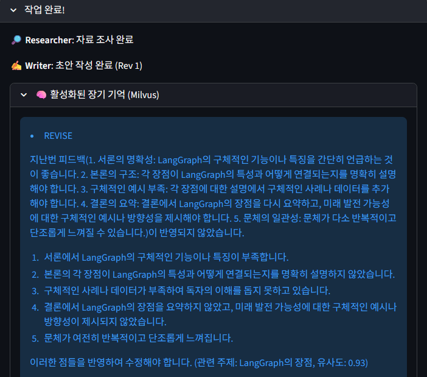
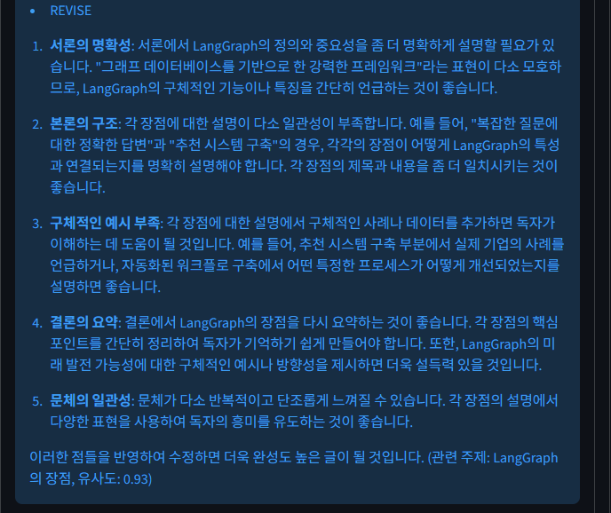
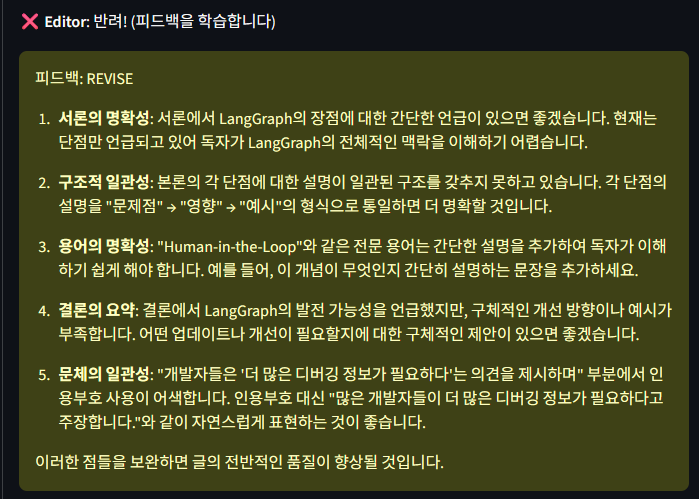
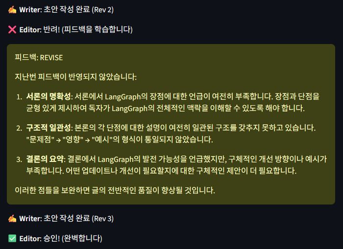
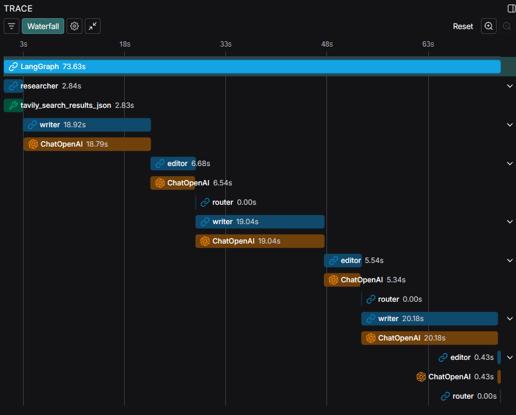
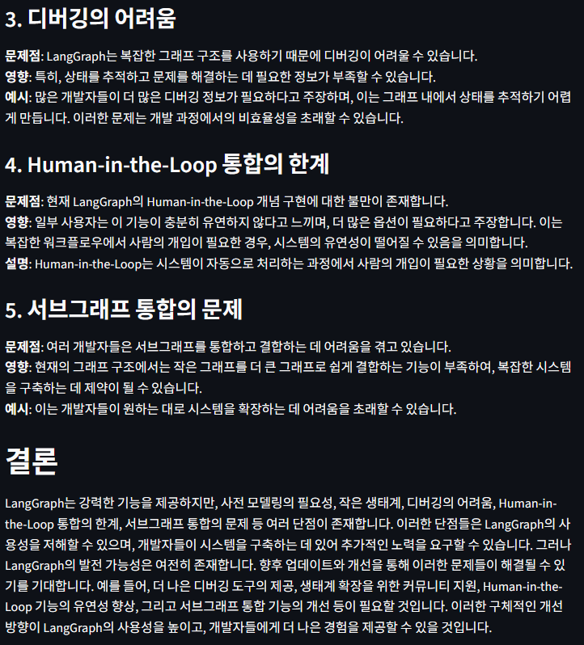

# 🧠 AI Editor Team v2: Memory-Augmented Autonomous Agents

이 프로젝트는 LangGraph 기반의 멀티 에이전트 시스템에 **Milvus(Vector DB)**를 결합하여, **"과거의 실수를 기억하고 스스로 성장하는 AI 팀"**을 구현한 v2.0 업데이트 버전입니다.

단순히 글을 작성하고 수정하는 것을 넘어, 장기 기억(Long-term Memory) 메커니즘을 도입하여 에이전트가 이전 프로젝트에서 받은 피드백을 영구적으로 학습하고, 새로운 작업 시 이를 선제적으로 반영하여 동일한 실수를 반복하지 않도록 설계되었습니다.

---

## 🌟 Evolution: From Basic to Memory-Augmented

| 구분 | Linear Chain | Agentic Workflow (v1) | **Memory-Augmented (v2, 현재)** |
| :--- | :--- | :--- | :--- |
| **흐름 제어** | 순차적 실행 (A→B) | 순환형 (Cyclic Loop) | **순환형 + 기억 조회 (Retrieval)** |
| **지식 범위** | 사전 학습 데이터 | 웹 검색 (Short-term) | **웹 검색 + 경험적 지식 (Long-term)** |
| **피드백 관리** | 일회성 소모 | 세션 내에서만 유효 | **영구 저장 및 프로젝트 간 전이** |
| **성장 가능성** | 없음 (항상 초기화) | 없음 (세션 종료 시 초기화) | **있음 (실행할수록 똑똑해짐)** |
| **운영 인프라** | Python Runtime | Python Runtime | **Docker Compose (Milvus, Etcd)** |

---

## 🏗️ 시스템 아키텍처 (v2.0)

본 시스템은 Docker 환경 위에서 Milvus와 LangGraph가 유기적으로 연동되는 구조입니다.

1. **Researcher Agent**: Tavily API를 통해 최신 정보를 수집합니다.
2. **Memory Manager (Milvus)**:
    - Retrieval: 현재 주제(Topic)와 유사한 과거의 지적 사항을 검색합니다. (Similarity Threshold > 0.6)
    - Storage: 에디터의 반려(REVISE) 피드백을 벡터화하여 영구 저장합니다.
3. **Writer Agent**: [수집된 정보] + **[과거의 실패 경험(Memory)]**을 동시에 고려하여 초안을 작성합니다.
4. **Editor Agent**: 초안을 검수합니다. 만약 이전 피드백이 반영되지 않았다면 더 강력한 비평을 가합니다.
5. **Router**: 승인 여부에 따라 프로세스를 종료하거나, 피드백을 저장하고 재작성을 지시합니다.

---

## 💻 실행 예시 (Demo & Proof of Concept)

v2 시스템이 어떻게 과거의 경험을 회상하고, 지속적으로 품질을 개선하는지 실제 사례를 통해 증명합니다.

### 1. 🧠 장기 기억 활성화 (Memory Retrieval)
새로운 주제인 **"LangGraph의 단점"**을 입력했을 때, 시스템은 Milvus DB에서 이전에 수행했던 유사 주제(**"LangGraph의 장점"**)의 피드백을 자동으로 호출합니다.

<table>
  <tr>
    <th colspan="2">Milvus 장기 기억 호출 (유사도 0.93) 및 회상된 과거 피드백 상세</th>
  </tr>
  <tr>
    <td align="center"></td>
    <td align="center"></td>
  </tr>
</table>

> **Key Insight**: 단순히 글을 쓰는 것이 아니라, 과거에 지적받았던 **"서론의 명확성"**, **"구조적 일관성"** 등의 데이터를 [유사도 0.93]으로 정확히 찾아내어 Writer에게 전달합니다.

<br>

### 2. 🔄 에이전트 간 자가 수정 루프 (Agentic Feedback Loop)
Editor 에이전트는 Writer가 작성한 초안이 과거의 피드백과 현재의 품질 기준을 만족하는지 엄격하게 검수합니다.

<table>
  <tr>
    <th colspan="2">에디터의 반려 및 비평 (Critique) 및 수정/최종 승인 프로세스</th>
  </tr>
  <tr>
    <td align="center"></td>
    <td align="center"></td>
  </tr>
</table>

> **Self-Correction Logic**:
> - **반려(REVISE)**: 피드백 반영 미흡 시 이유를 명시하여 재작성 요청 (Rev 2 과정).
> - **승인(ACCEPT)**: 지시 사항이 완벽히 반영된 것을 확인 후 최종 승인 (Rev 3 과정).

<br>

### 3. 📊 LangSmith를 통한 MLOps 추적 (Observability)
복잡한 멀티 에이전트의 순환 구조와 각 단계별 지연 시간(Latency)을 실시간으로 모니터링합니다.



> **Tracing Analysis**:
> - **Multi-Agent Coordination**: Researcher, Writer, Editor 간의 유기적인 핸드오버 확인.
> - **Total Latency**: 약 73.63초의 실행 시간 동안 총 3회의 수정 과정을 거쳐 고품질 콘텐츠 도출.

<br>

### 4. 📝 최종 결과물 (Sample Output)
과거의 피드백이 완벽히 반영된 최종 블로그 포스팅의 모습입니다.

| 최종 결과물 상단 (서론 ~ 본문 2) | 최종 결과물 하단 (본문 3 ~ 결론) |
| :---: | :---: |
|  |  |

> **개선 사항 반영 결과**:
> - **구조적 일관성**: "문제점 → 영향 → 예시"의 통일된 레이아웃 적용.
> - **전문성 강화**: 'Human-in-the-loop' 등 기술 용어에 대한 명확한 설명 및 결론부 제언 추가.

---

## 🚀 주요 기능 (v2.0 Highlights)
* **Long-term Memory (장기 기억)**: 에디터의 피드백이 휘발되지 않고 Milvus 벡터 DB에 저장되어, 서버를 재시작해도 에이전트의 경험치가 유지됩니다.
* **Context-Aware Retrieval (문맥 기반 회상)**: 주제(Topic) 기반 임베딩 검색을 통해, 현재 작성하려는 글과 연관된 과거의 실수만 선별적으로 가져옵니다. (유사도 임계값 적용)
* **Strict Compliance Check (지시 이행 검증)**: 에디터는 Writer가 이전 피드백을 제대로 반영했는지 확인하고, 무시할 경우 강도 높은 질책(Reinforced Critique)을 수행합니다.
* **Dockerized Infrastructure**: Milvus Standalone(Etcd, MinIO 포함) 환경을 Docker Compose로 구축하여 안정적인 로컬 벡터 저장소를 제공합니다.

---

## 🛠️ 기술 스택
* **Agent Framework**: LangGraph, LangChain
* **Vector Database**: Milvus (v2.4.11), PyMilvus
* **Infrastructure**: Docker, Docker Compose
* **LLM & Embedding**: OpenAI (gpt-4o-mini, text-embedding-3-small)
* **Observability**: LangSmith
* **Interface**: Streamlit

---

## 📦 설치 및 실행 방법 (Docker 환경 필수)
 - v2 버전은 Milvus 데이터베이스 구동을 위해 Docker가 필수적입니다.

### 1. 사전 준비 (Prerequisites)
    - Docker Desktop이 설치되어 있고 실행 중이어야 합니다.
    - Windows 사용자의 경우 WSL2 백엔드 메모리 할당(최소 4GB 권장)이 필요할 수 있습니다.

### 2. 프로젝트 설정 및 의존성 설치
 - uv를 사용하여 가상환경을 동기화합니다.
```bash
# uv 설치 및 라이브러리 동기화 (pymilvus 등 포함)
uv sync
```

### 3. 환경 변수 설정 (.env)
```bash
# LLM & Search API
OPENAI_API_KEY=your_openai_api_key
TAVILY_API_KEY=your_tavily_api_key

# LangSmith (Tracing & Monitoring)
LANGCHAIN_TRACING_V2=true
LANGCHAIN_ENDPOINT=https://api.smith.langchain.com
LANGCHAIN_API_KEY=your_langsmith_api_key
LANGCHAIN_PROJECT=ai-tech-blog-team
```

### 4. Milvus 서버 실행 (Docker Compose) 🐳
 - 프로젝트 루트(v2 폴더)에서 아래 명령어로 DB 컨테이너를 실행합니다.
```bash
# Milvus, Etcd, MinIO 컨테이너 실행
docker compose up -d

# 실행 상태 확인 (3개 컨테이너가 Up 상태여야 함)
docker compose ps
```

### 5. 애플리케이션 실행
```bash
# Streamlit 대시보드 실행
uv run streamlit run app.py
```

### 6. (선택) 메모리 저장 현황 확인
 - 에이전트가 학습한 데이터가 잘 쌓이고 있는지 확인하려면 별도 스크립트를 실행하세요.
```bash
uv run python check_memory.py
```

---

## 📈 프로젝트 성과 및 인사이트 (v2.0)
 - 지식의 전이(Transfer Learning) 구현: "LangGraph의 차이점"에서 지적받은 내용을 "LangGraph의 장점" 글을 쓸 때 스스로 적용하는 모습을 확인했습니다. (유사도 0.76)
 - 환각 및 오작동 방지: 유사도 필터링(Threshold 0.6)을 도입하여, 관련 없는 주제의 피드백이 글쓰기를 방해하는 문제를 기술적으로 해결했습니다.
 - 엔지니어링 역량 강화: Python 코드 레벨의 로직뿐만 아니라, Docker Container 기반의 MSA(Microservices Architecture) 데이터베이스 운영 경험을 확보했습니다.